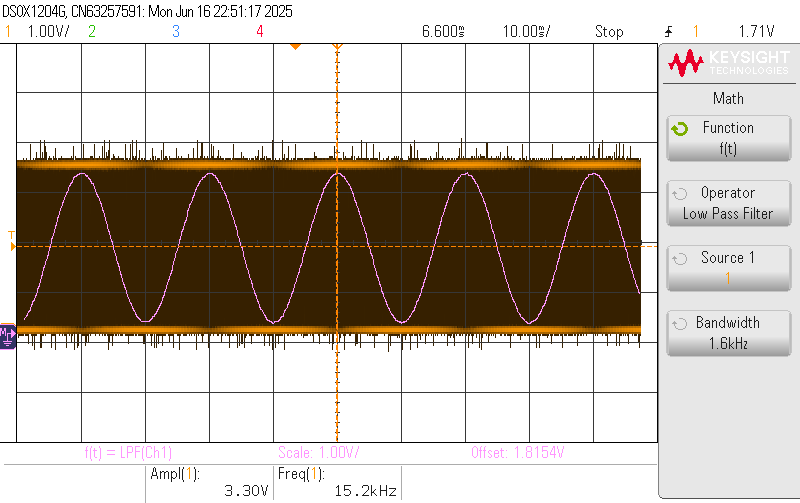

# STM32 SPWM Generator using LUT and DMA

This project implements a **Sinusoidal Pulse Width Modulation (SPWM)** generator on an STM32 microcontroller using a **LUT (Look-Up Table)** and **DMA** transfer to a **TIM4** timer.

## 🔧 Features

- Lookup Table (LUT) with sine values (precalculated duty cycles)
- DMA transfers the LUT values to TIM4 CCR register
- TIM4 configured in PWM mode to output the SPWM
- Continuous signal generation without CPU intervention
- GPIO output with sinusoidal-modulated PWM waveform

## 📚 Project Structure

- `Core/`, `Drivers/`: STM32CubeIDE generated structure
- `.ioc` file: STM32CubeMX configuration file for regenerating project
- `main.c`: Contains DMA init, LUT, and timer configuration
- `tim.c`: TIM4 configured for PWM generation
- `dma.c`: Configures DMA to transfer LUT values cyclically

## 🧪 Hardware Used

- MCU: STM32F103C8T6 (Blue Pill) [or specify yours]
- Output: TIM4 Channel [specify GPIO pin]
- Debug via UART (optional)

## ▶️ How to Run

1. Open the `.ioc` file with STM32CubeIDE.
2. Generate code and build the project.
3. Flash the firmware to your STM32 board.
4. Observe the SPWM signal on an oscilloscope at the GPIO pin.

## 💡 Notes

- You can modify the LUT resolution to change waveform fidelity.
- The PWM frequency and sine frequency depend on your timer base and DMA update rate.
- A simple RC or LC filter can be used to visualize the sine wave more smoothly.

## Waveform on Osciloscope

## 📜 License

MIT License

---
